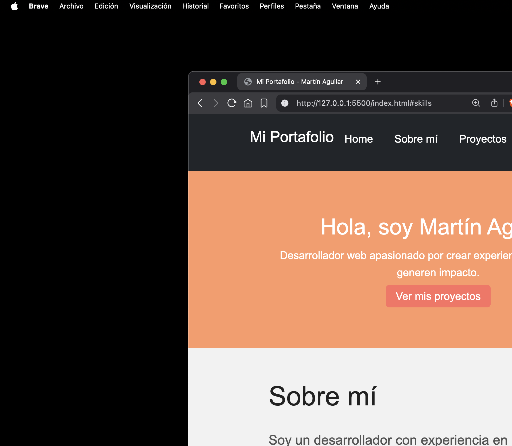

---

# **Martín Aguilar – Web Portfolio**



Portafolio personal desarrollado para presentar mis proyectos, habilidades y experiencia como desarrollador web. Construido con **HTML5, SASS**, **CSS modular**, y **Bootstrap 5**, siguiendo buenas prácticas de arquitectura y escalabilidad.

---

# 🚀 **Características**

* Estructura **HTML5 semántica** optimizada para SEO y accesibilidad.
* Diseño **responsive** utilizando Flexbox, Grid y Bootstrap 5.
* Arquitectura **SASS modular** siguiendo los principios de escalabilidad:

  * `abstracts/` para variables, mixins y placeholders
  * `base/` para estilos globales
  * `components/` para cada sección de la UI
  * `main.scss` como ensamblador
* Sistema de **temas claro/oscuro** con variables organizadas.
* **Páginas de detalle** para proyectos individuales.
* Navegación y footer consistentes en todas las páginas.
* Código accesible: uso de `alt`, ARIA roles y jerarquías correctas.

---

# 📁 **Estructura del Proyecto**

```
PORFOLIO-DEV/
│
├── assets/
│   ├── css/
│   ├── img/
│   └── sass/
│       ├── abstracts/
│       │   ├── _index.scss
│       │   ├── _mixins.scss
│       │   ├── _placeholders.scss
│       │   └── _variables.scss
│       │
│       ├── base/
│       │   ├── _global.scss
│       │   └── _reset.scss
│       │
│       ├── components/
│       │   ├── _buttons.scss
│       │   ├── _contacto.scss
│       │   ├── _footer.scss
│       │   ├── _header.scss
│       │   ├── _hero.scss
│       │   ├── _proyecto-detalle.scss
│       │   ├── _proyectos.scss
│       │   ├── _skills.scss
│       │   └── _sobre-mi.scss
│       │
│       └── main.scss
│
├── pages/
│   ├── project-Enginner.html
│   ├── project-bysbit.html
│   └── project-front.html
│
├── sketch/
│   ├── Winsical/
│   └── Wireframe.pdf
│
├── index.html
└── README.md
```

---

# 🎨 **Arquitectura SASS explicada**

Tu proyecto usa **SASS moderno basado en módulos**, evitando `@import` (obsoleto) y usando:

* `@use` → Para importar archivos
* `@forward` → Para re-exportar módulos desde un index
* `@extend` → Para usar placeholders
* `@mixin` / `@include` → Para lógica reutilizable
* `@if`, `@each`, `@for` → Para control de estilos dinámicos

### ✔️ Estructura modular

* **abstracts/**:
  Variables globales, mixins, funciones y placeholders.
  Se centralizan y se re-exportan con:

  ```scss
  // abstracts/_index.scss
  @forward "variables";
  @forward "mixins";
  @forward "placeholders";
  ```

* **base/**:
  Estilos fundamentales del proyecto (reset + estilos globales).

* **components/**:
  Cada sección del sitio tiene su propio archivo SCSS.

* **main.scss**:
  Archivo maestro que ensambla todos los módulos:

  ```scss
  @use "abstracts/index" as *;

  @use "base/reset";
  @use "base/global";

  @use "components/buttons";
  @use "components/header";
  @use "components/hero";
  @use "components/sobre-mi";
  @use "components/skills";
  @use "components/proyectos";
  @use "components/contacto";
  @use "components/footer";
  @use "components/proyecto-detalle";
  ```

### ✔️ Resultado

SASS compila todo en **un único archivo CSS limpio y optimizado**.

---

# 🧩 **Diagrama del flujo SASS**

```
                                        main.scss
                                            │
               ┌────────────────────────────┼────────────────────────────────┐
               │                            │                                │
               ▼                            ▼                                ▼

        ┌────────────────┐           ┌──────────────┐                ┌────────────────┐
        │   abstracts    │           │     base     │                │   components   │
        │  index.scss    │           │ reset.scss   │                │ hero.scss      │
        │ (usa @forward) │           │ global.scss  │                │ header.scss    │
        └───────┬────────┘           └──────┬───────┘                │ proyectos.scss │
                │                           │                        │ ...            │
                │ @forward                  │ @use                   └──────┬─────────┘
                │                           │                               │ @use
                ▼                           ▼                               ▼
   ┌────────────────────────┐    ┌───────────────────────────┐     ┌─────────────────────────┐
   │ variables.scss         │    │ Variables, mixins         │     │ Usa variables, mixins   │
   │ mixins.scss            │    │ y placeholders disponibles│     │ y placeholders          │
   │ placeholders.scss      │    └───────────────────────────┘     └─────────────────────────┘
   └────────────────────────┘

                   ▼  (todo se consolida en un único CSS)
               ┌──────────────────────────────┐
               │          CSS final           │
               └──────────────────────────────┘
```

---

# 🛠️ **Cómo ejecutar el proyecto**

1. Clonar el repositorio:

```bash
git clone https://github.com/Marttify/porfolio_marttify.git
cd porfolio_marttify
```

2. Compilar SASS:

```bash
sass --watch assets/sass/main.scss assets/css/main.css
```

3. Abrir el archivo:

```
index.html
```

---

# 📚 **Tecnologías utilizadas**

* **HTML5**
* **CSS3** (Flexbox, Grid)
* **SASS / SCSS**
* **Bootstrap 5**
* Arquitectura modular
* Git / GitHub

---

# 📄 **Licencia**

Este portafolio es para uso personal y con fines educativos.
© 2025 Martín Aguilar.

---
